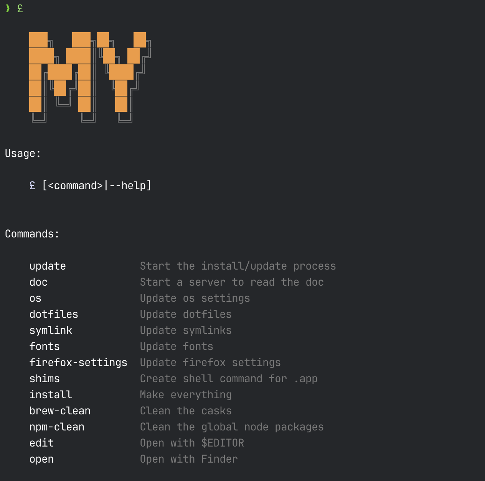

# My! Oh My!


My own environment for macOS.<br>
Scripts, themes, dotfiles.<br>
All what I need.<br>

<br>
<br>
<br>
<br>
<br>
<br>
<br>
<br>

## Run the script and watch the sky!

```shell
curl -L --silent https://install.my.kud.io|zsh
```

## Usage

The main command is:

```shell
£
```

#### Preview


