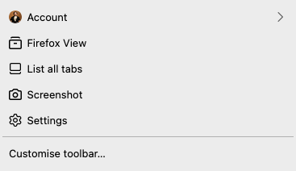
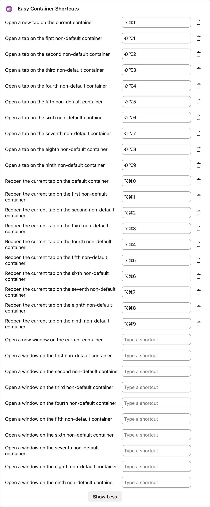
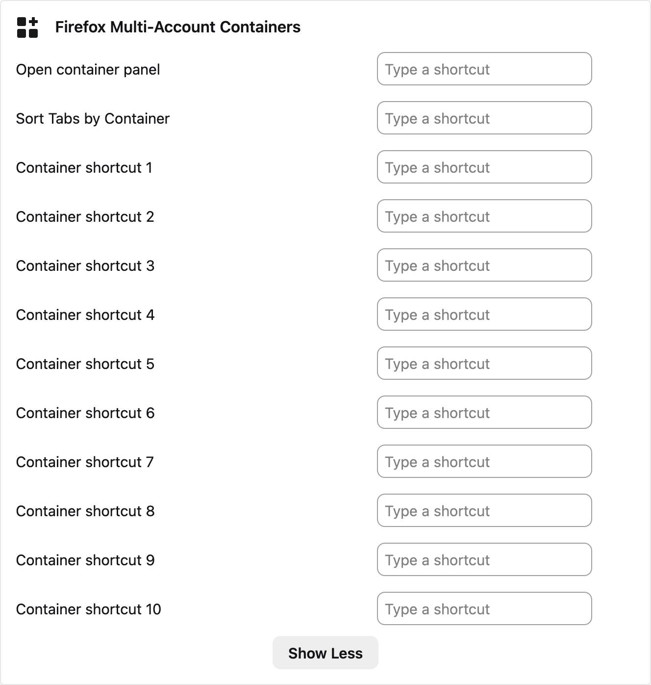
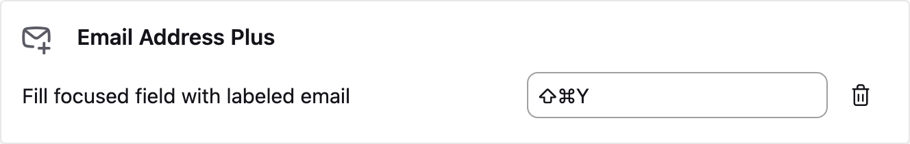
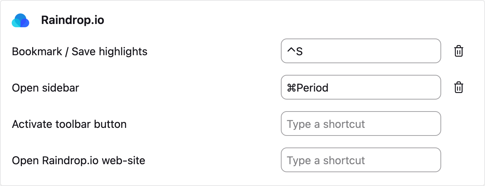
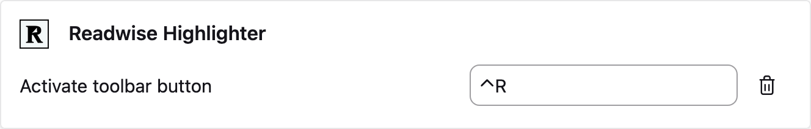
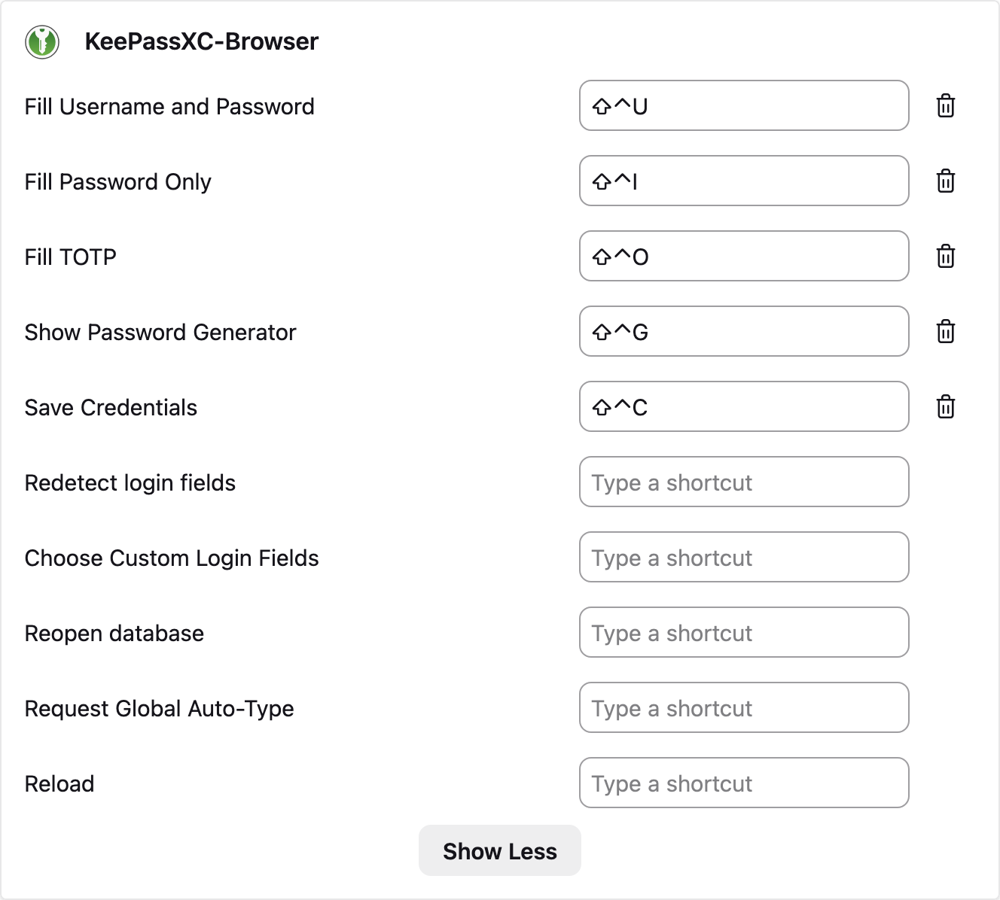
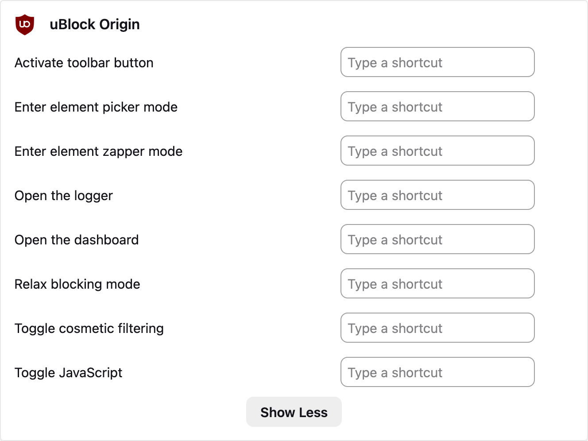
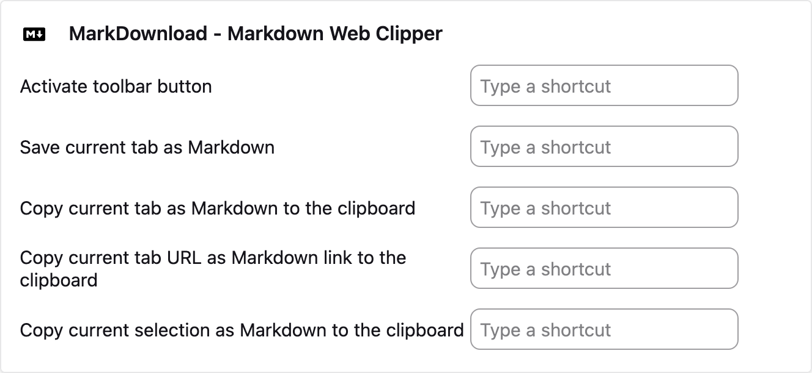
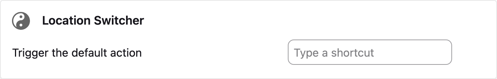

# Firefox

- Launch Firefox, close it after ~5 seconds, then run: `my run firefox`
- Login to Sync for bookmarks/preferences.
- GUI customisation as desired.
- Set Gmail as default mail handler (via handler prompt or settings) if needed.
- Add `!g` for quick Google search if using keyword shortcuts.

## GUI

### Adaptive Tab Bar Colour

Import `$SYNC_FOLDER/Appdata/Firefox/atbc_pref.json` in the addon's settings.

### Extension Hotkey Reference

Below are the captured screenshots of configured extension keyboard shortcuts. Configure them manually in each addon's Manage Extension Shortcuts panel.

