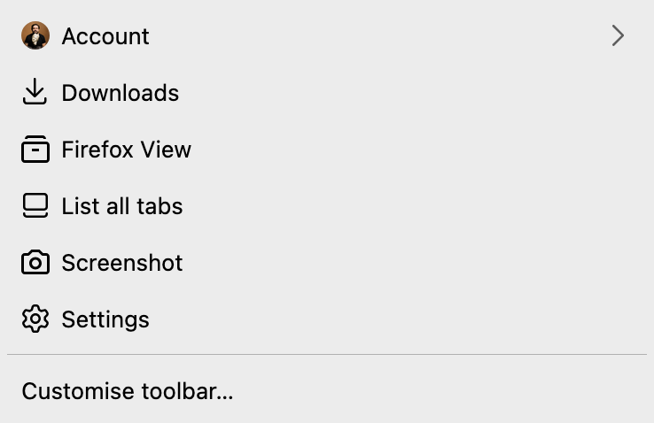

# Firefox

- Launch Firefox, close it after ~5 seconds, then run: `my run firefox`
- Login to Sync for bookmarks/preferences.
- GUI customisation as desired.
- Set Gmail as default mail handler (via handler prompt or settings) if needed.
- Add `!g` for quick Google search if using keyword shortcuts.

## Screenshots

### Adaptive Tab Bar Colour

